# Kyber Fitness — Agent Instruction & Codebase Guide

Welcome, Agent! This document serves as the single source of truth for the **Kyber Fitness** codebase, architecture, design system, and key implementation rules. Refer to this guide to onboard rapidly, preserve architectural constraints, and avoid common full-stack gotchas (especially regarding Clerk SSR and server functions).

---

## 1. Project Overview & Architecture

**Kyber Fitness** is a premium, full-stack fitness and athletic coaching platform designed to bridge the gap between individual athletes and professional personal trainers. The application allows:

- **Individuals** to track workout sessions, exercises, sets, reps, weights, cardio metrics, and chronological health metrics.
- **Trainers** to track their own workouts, invite/manage clients, build reusable workout program templates, assign those programs to active clients, and request secure consent to view dashboard progress or log sessions on behalf of active, consented athletes.
- **Visuals** to feel like a modern, clean, high-performance SaaS dashboard with rich aesthetics.

### Technical Stack & Configuration

Kyber Fitness utilizes a highly optimized typescript stack:

| Layer              | Technology                                      | Configuration Details                                                          |
| ------------------ | ----------------------------------------------- | ------------------------------------------------------------------------------ |
| **Framework**      | **TanStack Start** (React 19 + Vinxi + Vite)    | High-performance isomorphic rendering.                                         |
| **Routing**        | **TanStack Router**                             | File-system-based routing with automatic code splitting and typesafe links.    |
| **Authentication** | **Clerk** (`@clerk/tanstack-start`)             | Secure, robust, multi-tenant session management.                               |
| **Database**       | **Drizzle ORM** + **SQLite** (`better-sqlite3`) | Local file database (`fitness.db`) with lightweight Drizzle driver.            |
| **Styles**         | **Tailwind CSS v4** + **Vanilla CSS**           | Performance-first custom styling with dynamic dark mode and custom animations. |
| **Icons**          | **Lucide React**                                | Sleek and minimal iconography.                                                 |
| **Charts**         | **Recharts** / Inline SVGs                      | Clean trend lines for health metric tracking.                                  |
| **Quality**        | **Oxlint** + **Prettier**                       | Fast linting and repo-wide formatting via pnpm scripts.                        |

---

## 2. Core Principles

1. **Separation of Concerns**: Keep authentication (Clerk) and application persistence (SQLite) separate.
2. **Identity Source of Truth**: Clerk is the absolute source of truth for user identity.
3. **Application Persistence Source of Truth**: SQLite via Drizzle ORM acts as the secure, local database of record.
4. **Clerk User IDs**: Store Clerk user IDs as `text` in the SQLite database to avoid relational mapping overhead.
5. **Server-Side Boundaries**: Keep all Drizzle/database access server-side.
6. **Isomorphic Server Functions**: Use TanStack Start server functions (`createServerFn`) for protected mutations and sensitive reads.
7. **Permission Enforcement**: Enforce server-side permissions before executing any client or trainer action.
8. **UI Modularity**: Keep React components highly reusable and composable.
9. **Robust Aesthetics First**: Build UI elements that WOW the user, relying on mock data first if necessary, before wiring server functions.
10. **Incremental Development**: Write and verify logic in small, highly testable increments.
11. **Documentation Drift Prevention**: Whenever you add, remove, or materially change product features, routes, schema tables, auth/permission behavior, deployment requirements, or quality tooling, update both `AGENTS.md` and `README.md` in the same branch.

---

## 3. Environment Variables

Define the following environment variables inside the `.env` configuration at the application root:

```env
VITE_CLERK_PUBLISHABLE_KEY=pk_test_...
CLERK_SECRET_KEY=sk_test_...
VITE_CLERK_SIGN_IN_URL=/sign-in
VITE_CLERK_SIGN_UP_URL=/sign-up
```

### Rules:

- `VITE_CLERK_PUBLISHABLE_KEY` and redirect URLs may be used on the client-side.
- `CLERK_SECRET_KEY` is highly sensitive and must only be accessed in server-side blocks.
- **No Database URL Required**: The local SQLite database resolves dynamically to the file `fitness.db` in the workspace root. Do not commit secrets.

---

## 4. Current Folder Structure

The project implements a flat, route-driven structure using isomorphic actions:

```txt
kyber-fitness/
  drizzle/              # Drizzle SQL migration output files
  public/               # Static assets
  src/
    components/         # Reusable UI components
      Footer.tsx        # Standard footer
      Header.tsx        # Responsive navigation header
      ThemeToggle.tsx   # Glassmorphic light/dark mode switch

    lib/
      db/               # Database files
        index.ts        # Database connection instantiation
        schema.ts       # Database Drizzle schema
        seed.ts         # Seeding script for exercises and trainers
      actions.ts        # Isomorphic server functions (CRUD, permissions)
      auth-server.ts    # Secure Clerk server authentication helpers

    types/              # Shared TypeScript DTOs and form/editor payload types
      domain.ts         # Server-return/domain records used across routes
      profile-forms.ts  # Onboarding and settings payload shapes
      workout-editor.ts # Shared workout/program builder editor payloads

    routes/             # File-system router
      __root.tsx        # Document structure, ClerkProvider, ThemeProvider, global errors
      index.tsx         # Premium visual landing page
      onboarding.tsx    # Multi-step profile and role registration
      dashboard.tsx     # Dashboard for individual athletes and coaches
      clients/          # Trainer client network administration
      health/           # Health metric visualization and charting
      my-trainers/      # Individual athlete trainer request pages
      programs/         # Trainer program template builder and assignment desk
      sign-in/          # Splat folder ($) for path-based Clerk login
      sign-up/          # Splat folder ($) for path-based Clerk registration
      settings.tsx      # Unified settings dashboard for athletes and coaches
      workouts/         # Workout log logs and custom set/exercise builders

  drizzle.config.ts     # Drizzle Kit migration configuration
  fitness.db            # SQLite database file (Local)
  package.json          # Dependency configurations
  tsconfig.json         # TypeScript configuration
  vite.config.ts        # Vite/Vinxi packaging configuration
```

### Type Organization Rules

- Keep reusable domain/data-transfer shapes in `src/types/domain.ts`.
- Keep reusable form/editor payloads in focused files such as `src/types/workout-editor.ts` and `src/types/profile-forms.ts`.
- Keep component-only props and local UI helper types beside the component in `*.types.ts` files, e.g. `src/components/DatePicker.types.ts`.
- Do not re-declare duplicate `SetInput`, `ExerciseInput`, profile payload, trainer-client, workout session, or health metric shapes inside routes/components. Import existing types and extend them only when the local UI genuinely needs a narrower view model.

---

## 5. Stitch Kinetic Aesthetic System

Kyber Fitness features a highly responsive, modern dark-themed dashboard. Agents must strictly adhere to the following visual design guidelines:

### Theme Palette (Stitch Kinetic)

- **Backgrounds**: Deep Charcoal (`#0a0a0a` / `#121212` / `#131313`) for container cards and base frames, generating a sleek, premium contrast.
- **Accents**:
  - **Electric Lime (`#c3f400`)**: Core high-energy highlight used for CTA buttons, success rings, active tabs, and primary metrics.
  - **Cyan (`#00eefc`)**: Tech highlight used for secondary interactions, data nodes, chart lines, and informative borders.
- **Surfaces**: Semi-transparent overlays using **Glassmorphism** and backdrop-filters (`rgba(255, 255, 255, 0.03)` with `backdrop-filter: blur(12px)`).

### CSS Styling & Tailwind CSS v4 Configuration

Tailwind CSS v4 is configured dynamically using a hybrid approach. The theme token values are declared as standard CSS custom variables in the `@theme` block inside `src/styles.css`:

```css
/* src/styles.css */
@import 'tailwindcss';

@theme {
  --font-sans: 'Lexend', ui-sans-serif, system-ui, sans-serif;
}

:root {
  --background: #131313;
  --surface: #131313;
  --primary-container: #c3f400; /* Electric Lime */
  --secondary-container: #00eefc; /* Cyan */
  /* Glassmorphism template properties... */
}
```

---

## 6. Database Schema Reference

The database engine is SQLite, mapped via Drizzle ORM inside `src/lib/db/schema.ts`. Here is the relational mapping:

```mermaid
erDiagram
    users ||--|| profiles : "has profile"
    users ||--|| trainer_profiles : "has professional profile"
    users ||--o{ trainer_clients : "participates in"
    users ||--o{ workout_sessions : "performs / logs"
    users ||--o{ health_metrics : "logs metrics"
    users ||--o{ workout_programs : "creates"
    users ||--o{ program_assignments : "receives / assigns"
    workout_sessions ||--o{ session_exercises : "contains"
    exercises ||--o{ session_exercises : "is added to"
    session_exercises ||--o{ exercise_sets : "has sets"
    workout_programs ||--o{ workout_program_exercises : "contains"
    workout_programs ||--o{ program_assignments : "is assigned"
    workout_program_exercises ||--o{ workout_program_sets : "has target sets"

    users {
        text id PK "Clerk User ID"
        text email
        text name
        text role "individual | trainer"
        text createdAt
        text updatedAt
    }

    profiles {
        text id PK
        text userId FK "Cascade references users.id"
        text dateOfBirth
        text gender
        real height
        text activityLevel
        text fitnessGoal
        text notes
    }

    trainer_profiles {
        text id PK
        text userId FK "Cascade references users.id"
        text businessName
        text bio
        text specialization
        integer yearsExperience
    }

    trainer_clients {
        text id PK
        text trainerId FK "References users.id"
        text clientId FK "References users.id"
        text status "pending | active | declined | removed"
        text permissions "JSON string (permissions vector)"
        text createdAt
        text updatedAt
    }

    workout_sessions {
        text id PK
        text userId FK "References users.id"
        text recordedByUserId FK "References users.id"
        text title
        text sessionDate
        integer durationMinutes
        text location
        text notes
        text createdAt
        text updatedAt
    }

    exercises {
        text id PK
        text name
        text category "strength | cardio | bodyweight | mobility"
        text defaultUnit "kg | lbs | km | miles"
        text createdByUserId FK "References users.id"
        integer isGlobal "1 (global) | 0 (custom)"
    }

    session_exercises {
        text id PK
        text workoutSessionId FK "Cascade references workout_sessions.id"
        text exerciseId FK "Cascade references exercises.id"
        integer orderIndex
        text notes
    }

    exercise_sets {
        text id PK
        text sessionExerciseId FK "Cascade references session_exercises.id"
        integer setNumber
        integer reps
        real weight
        integer durationSeconds
        real distance
        integer restSeconds
        text intensity "RPE/pace"
        text notes
    }

    health_metrics {
        text id PK
        text userId FK "Cascade references users.id"
        text metricType "weight | body_fat | resting_hr"
        real value
        text unit
        text recordedAt
        text recordedByUserId FK "References users.id"
        text notes
    }

    workout_programs {
        text id PK
        text createdByUserId FK "Trainer users.id"
        text title
        text notes
        text createdAt
        text updatedAt
    }

    workout_program_exercises {
        text id PK
        text programId FK "Cascade references workout_programs.id"
        text exerciseId FK "Cascade references exercises.id"
        integer orderIndex
        text notes
    }

    workout_program_sets {
        text id PK
        text programExerciseId FK "Cascade references workout_program_exercises.id"
        integer setNumber
        integer reps
        real weight
        integer durationSeconds
        real distance
        integer restSeconds
        text intensity "RPE/pace"
        text notes
    }

    program_assignments {
        text id PK
        text programId FK "Cascade references workout_programs.id"
        text clientId FK "Athlete users.id"
        text assignedByUserId FK "Trainer users.id"
        text status "pending | completed"
        text notes
        text assignedAt
        text completedAt
    }
```



---

## 7. Critical Development Gotchas for Agents

Working with TanStack Start, server functions, and Clerk requires strict adherence to these technical constraints:

### ⚠️ Gotcha #1: Clerk Context Loss inside Vinxi (SSR)

- **Symptom**: Unhandled HTTP Errors or `Context is not available` on initial server-side render.
- **Cause**: Clerk and TanStack Start run in Vinxi, which uses separate instances of the `unctx` library for async context. If `@clerk/tanstack-start` is bundled as an external dependency, the request context is lost.
- **Rule**: `@clerk/tanstack-start` **MUST** be placed in Vite's `ssr.noExternal` configuration in `vite.config.ts`. Do not remove it!

```typescript
// vite.config.ts
export default defineConfig({
  ssr: {
    noExternal: ['@clerk/tanstack-start'],
  },
  // ...
})
```

### ⚠️ Gotcha #2: Swallow Redirect Handshakes in Server Functions

- **Symptom**: User logins trigger infinite loops or fail to sign in, throwing generic `500 Internal Server Errors`.
- **Cause**: During authentication state initialization, Clerk throws redirection headers as a raw `Response` object inside `getAuth()`. If this error is wrapped in a standard `try/catch` block and swallowed (or transformed into a generic JSON error), Clerk's routing bubble-up fails.
- **Rule**: Whenever you write or wrap code checking auth context (e.g. `getAuthUser` or `requireAuthUser`), **YOU MUST check if the caught error is a `Response` and rethrow it immediately**:

```typescript
// Example from src/lib/auth-server.ts
export async function getAuthUser(opts?: { shouldRedirect?: boolean }) {
  try {
    const auth = await getAuth(getRequest())
    // ... logic to query user ...
  } catch (error) {
    if (error instanceof Response) {
      throw error // CRITICAL: Let Clerk's Redirect Bubble Up!
    }
    // Handle actual runtime errors
  }
}
```

### ⚠️ Gotcha #3: Clerk Auth Routing Splats

- **Symptom**: Custom paths like `/sign-in/factor-one` return 404 errors.
- **Cause**: Clerk's login components use path-based multi-step routing (`routing="path"`). When using TanStack Start's router, nested files won't capture these dynamic paths automatically.
- **Rule**: Authentication routes must use splat/wildcard paths (`$.tsx`) to ensure Clerk resolves intermediate screens.
  - Sign In file: `src/routes/sign-in/$.tsx`
  - Sign Up file: `src/routes/sign-up/$.tsx`

### ⚠️ Gotcha #4: Hydration Mismatches & Browser Extension Conflicts

- **Symptom**: React Hydration warnings trigger in the console.
- **Cause**: Clerk dynamically injects script payloads, and browser extensions inject elements, differing from server-rendered HTML.
- **Rule**: Always preserve the `suppressHydrationWarning` tag on the HTML and Body root nodes in `src/routes/__root.tsx`.

### ⚠️ Gotcha #5: Clerk Redirect Loops under Missing/Unconfigured Keys (Live Netlify/SSR)

- **Symptom**: The site returns `ERR_TOO_MANY_REDIRECTS` on the live environment because Clerk's middleware is triggered on document requests without valid credentials, failing context validation repeatedly.
- **Cause**: Clerk's SSR wrapper forces authentication handshakes and throws redirection headers. Without valid keys, it gets stuck in an infinite redirect cascade.
- **Rule**: Conditionally wrap `createStartHandler` with `createClerkHandler` in `src/server.ts` only when valid credentials are present. If keys are missing, bypass Clerk completely and serve a custom glassmorphic diagnostic screen for HTML document requests. Similarly, conditionally bypass `<ClerkProvider>` in `src/routes/__root.tsx` to display a beautiful "Sync Offline" notification instead of letting the application crash or loop.

---

## 8. Access Control & Permission Matrix

Kyber Fitness enforces a secure Trainer-Client permission system inside `src/lib/actions.ts`.

- **Self-Access**: Individuals can always read, write, and update their own workouts and profiles. Profile / biometric and coaching credential updates are securely mapped through the `updateUserProfile` action under transaction safety.
- **Trainer-Client Relationship**:
  - A trainer can only view data or log sessions for an athlete if there is an active contract inside `trainerClients` with `status = 'active'`.
  - Permissions are serialized inside a JSON column in `trainer_clients.permissions` (e.g., `{"canViewHealthData": true, "canAddSessions": true}`).
  - Before performing any trainer actions, agents must execute the server-side validation hook `verifyTrainerClientAccess(trainerId, clientId)`.
- **Program Templates and Assignments**:
  - Trainers can create, edit, and delete only workout programs where `workoutPrograms.createdByUserId` matches their Clerk user ID.
  - Athletes can load a program only through a pending or historical assignment that belongs to their own user ID.
  - Completing an assigned workout must be validated server-side against `programAssignments.id`, `clientId`, and `status = 'pending'`; coach-entered client sessions must not complete athlete assignments.

```typescript
// Active permission check helper inside actions.ts
async function verifyTrainerClientAccess(trainerId: string, clientId: string) {
  const rel = await db
    .select()
    .from(trainerClients)
    .where(
      and(
        eq(trainerClients.trainerId, trainerId),
        eq(trainerClients.clientId, clientId),
        eq(trainerClients.status, 'active'),
      ),
    )
    .limit(1)
  return rel.length > 0
}
```

---

## 9. Operational Runbook

### Package Manager Setup

We use `pnpm` as the package manager for the workspace. Due to security restrictions on workspace packages in pnpm v11+, any scripts of external packages must be allowed inside `pnpm-workspace.yaml` under `allowBuilds` key:

```yaml
allowBuilds:
  '@clerk/shared': true
  '@parcel/watcher': true
  'better-sqlite3': true
  'esbuild': true
  'lightningcss': true
  'sharp': true
```

### Running the App Locally

```bash
# Navigate to the workspace subfolder
cd kyber-fitness

# Install dependencies
pnpm install

# Run the Vinxi development server
pnpm run dev
```

The server will boot on `http://localhost:3000`.

### Quality Commands

```bash
# Fast JavaScript/TypeScript linting
pnpm run lint

# Apply safe Oxlint fixes
pnpm run lint:fix

# Format the repo with Prettier
pnpm run format

# Check formatting in CI/local review
pnpm run format:check
```

### Documentation Maintenance

Whenever a branch adds or changes a feature, route, schema table, server action contract, permission rule, environment variable, deployment rule, or developer command, update both `AGENTS.md` and `README.md` before committing. Treat this as part of the feature definition, not a follow-up chore.

### Database Operations

If you edit `schema.ts`, you need to sync the SQLite file:

```bash
# Push changes to SQLite DB
npx drizzle-kit push

# Re-run seed script to load exercises and demo trainers
pnpm run db:seed
```

---

## 10. Netlify Deployment Strategy

Kyber Fitness is configured for serverless hosting on **Netlify** using `@netlify/vite-plugin-tanstack-start`.

### Key Elements:

1. **Plugin Integration**: We added `netlify()` plugin inside `vite.config.ts`.
2. **Settings**: Configured build steps inside `netlify.toml` targeting `pnpm run build` and publishing `dist/client`.
3. **Strict Dependency Resolution**: Added `unctx` as a direct dependency in `package.json` to resolve Rolldown compilation import resolution errors on Netlify due to pnpm's strict layout structure.
4. **Environment Configuration**: You MUST supply the Clerk credentials (`CLERK_SECRET_KEY`, `VITE_CLERK_PUBLISHABLE_KEY`, `VITE_CLERK_SIGN_IN_URL`, `VITE_CLERK_SIGN_UP_URL`) as Site environment variables on Netlify.

---

Always double-check that your work preserves visual beauty, follows hydration standards, and honors the Clerk rethrow policies! Keep building the ultimate athletic hub.

---

<!-- intent-skills:start -->

# Skill mappings - load `use` with `npx @tanstack/intent@latest load <use>`.

skills:

- when: "Install TanStack Devtools, pick framework adapter (React/Vue/Solid/Preact), register plugins via plugins prop, configure shell (position, hotkeys, theme, hideUntilHover, requireUrlFlag, eventBusConfig). TanStackDevtools component, defaultOpen, localStorage persistence."
  use: "@tanstack/devtools#devtools-app-setup"
- when: "Publish plugin to npm and submit to TanStack Devtools Marketplace. PluginMetadata registry format, plugin-registry.ts, pluginImport (importName, type), requires (packageName, minVersion), framework tagging, multi-framework submissions, featured plugins."
  use: "@tanstack/devtools#devtools-marketplace"
- when: "Build devtools panel components that display emitted event data. Listen via EventClient.on(), handle theme (light/dark), use @tanstack/devtools-ui components. Plugin registration (name, render, id, defaultOpen), lifecycle (mount, activate, destroy), max 3 active plugins. Two paths: Solid.js core with devtools-ui for multi-framework support, or framework-specific panels."
  use: "@tanstack/devtools#devtools-plugin-panel"
- when: "Handle devtools in production vs development. removeDevtoolsOnBuild, devDependency vs regular dependency, conditional imports, NoOp plugin variants for tree-shaking, non-Vite production exclusion patterns."
  use: "@tanstack/devtools#devtools-production"
- when: "Two-way event patterns between devtools panel and application. App-to-devtools observation, devtools-to-app commands, time-travel debugging with snapshots and revert. structuredClone for snapshot safety, distinct event suffixes for observation vs commands, serializable payloads only."
  use: "@tanstack/devtools-event-client#devtools-bidirectional"
- when: "Create typed EventClient for a library. Define event maps with typed payloads, pluginId auto-prepend namespacing, emit()/on()/onAll()/onAllPluginEvents() API. Connection lifecycle (5 retries, 300ms), event queuing, enabled/disabled state, SSR fallbacks, singleton pattern. Unique pluginId requirement to avoid event collisions."
  use: "@tanstack/devtools-event-client#devtools-event-client"
- when: "Analyze library codebase for critical architecture and debugging points, add strategic event emissions. Identify middleware boundaries, state transitions, lifecycle hooks. Consolidate events (1 not 15), debounce high-frequency updates, DRY shared payload fields, guard emit() for production. Transparent server/client event bridging."
  use: "@tanstack/devtools-event-client#devtools-instrumentation"
- when: "Configure @tanstack/devtools-vite for source inspection (data-tsd-source, inspectHotkey, ignore patterns), console piping (client-to-server, server-to-client, levels), enhanced logging, server event bus (port, host, HTTPS), production stripping (removeDevtoolsOnBuild), editor integration (launch-editor, custom editor.open). Must be FIRST plugin in Vite config. Vite ^6 || ^7 only."
  use: "@tanstack/devtools-vite#devtools-vite-plugin"
- when: "Step-by-step migration from Next.js App Router to TanStack Start: route definition conversion, API mapping, server function conversion from Server Actions, middleware conversion, data fetching pattern changes."
  use: "@tanstack/react-start#lifecycle/migrate-from-nextjs"
- when: "React bindings for TanStack Start: createStart, StartClient, StartServer, React-specific imports, re-exports from @tanstack/react-router, full project setup with React, useServerFn hook."
  use: "@tanstack/react-start#react-start"
- when: "Implement, review, debug, and refactor TanStack Start React Server Components in React 19 apps. Use when tasks mention @tanstack/react-start/rsc, renderServerComponent, createCompositeComponent, CompositeComponent, renderToReadableStream, createFromReadableStream, createFromFetch, Composite Components, React Flight streams, loader or query owned RSC caching, router.invalidate, structuralSharing: false, selective SSR, stale names like renderRsc or .validator, or migration from Next App Router RSC patterns. Do not use for generic SSR or non-TanStack RSC frameworks except brief comparison."
  use: "@tanstack/react-start#react-start/server-components"
- when: "Framework-agnostic core concepts for TanStack Router: route trees, createRouter, createRoute, createRootRoute, createRootRouteWithContext, addChildren, Register type declaration, route matching, route sorting, file naming conventions. Entry point for all router skills."
  use: "@tanstack/router-core#router-core"
- when: "Route protection with beforeLoad, redirect()/throw redirect(), isRedirect helper, authenticated layout routes (\_authenticated), non-redirect auth (inline login), RBAC with roles and permissions, auth provider integration (Auth0, Clerk, Supabase), router context for auth state."
  use: "@tanstack/router-core#router-core/auth-and-guards"
- when: "Automatic code splitting (autoCodeSplitting), .lazy.tsx convention, createLazyFileRoute, createLazyRoute, lazyRouteComponent, getRouteApi for typed hooks in split files, codeSplitGroupings per-route override, splitBehavior programmatic config, critical vs non-critical properties."
  use: "@tanstack/router-core#router-core/code-splitting"
- when: "Route loader option, loaderDeps for cache keys, staleTime/gcTime/ defaultPreloadStaleTime SWR caching, pendingComponent/pendingMs/ pendingMinMs, errorComponent/onError/onCatch, beforeLoad, router context and createRootRouteWithContext DI pattern, router.invalidate, Await component, deferred data loading with unawaited promises."
  use: "@tanstack/router-core#router-core/data-loading"
- when: "Link component, useNavigate, Navigate component, router.navigate, ToOptions/NavigateOptions/LinkOptions, from/to relative navigation, activeOptions/activeProps, preloading (intent/viewport/render), preloadDelay, navigation blocking (useBlocker, Block), createLink, linkOptions helper, scroll restoration, MatchRoute."
  use: "@tanstack/router-core#router-core/navigation"
- when: "notFound() function, notFoundComponent, defaultNotFoundComponent, notFoundMode (fuzzy/root), errorComponent, CatchBoundary, CatchNotFound, isNotFound, NotFoundRoute (deprecated), route masking (mask option, createRouteMask, unmaskOnReload)."
  use: "@tanstack/router-core#router-core/not-found-and-errors"
- when: "Dynamic path segments ($paramName), splat routes ($ / \_splat), optional params ({-$paramName}), prefix/suffix patterns ({$param}.ext), useParams, params.parse/stringify, pathParamsAllowedCharacters, i18n locale patterns."
  use: "@tanstack/router-core#router-core/path-params"
- when: "validateSearch, search param validation with Zod/Valibot/ArkType adapters, fallback(), search middlewares (retainSearchParams, stripSearchParams), custom serialization (parseSearch, stringifySearch), search param inheritance, loaderDeps for cache keys, reading and writing search params."
  use: "@tanstack/router-core#router-core/search-params"
- when: "Non-streaming and streaming SSR, RouterClient/RouterServer, renderRouterToString/renderRouterToStream, createRequestHandler, defaultRenderHandler/defaultStreamHandler, HeadContent/Scripts components, head route option (meta/links/styles/scripts), ScriptOnce, automatic loader dehydration/hydration, memory history on server, data serialization, document head management."
  use: "@tanstack/router-core#router-core/ssr"
- when: "Full type inference philosophy (never cast, never annotate inferred values), Register module declaration, from narrowing on hooks and Link, strict:false for shared components, getRouteApi for code-split typed access, addChildren with object syntax for TS perf, LinkProps and ValidateLinkOptions type utilities, as const satisfies pattern."
  use: "@tanstack/router-core#router-core/type-safety"
- when: "TanStack Router bundler plugin for route generation and automatic code splitting. Supports Vite, Webpack, Rspack, and esbuild. Configures autoCodeSplitting, routesDirectory, target framework, and code split groupings."
  use: "@tanstack/router-plugin#router-plugin"
- when: "Core overview for TanStack Start: tanstackStart() Vite plugin, getRouter() factory, root route document shell (HeadContent, Scripts, Outlet), client/server entry points, routeTree.gen.ts, tsconfig configuration. Entry point for all Start skills."
  use: "@tanstack/start-client-core#start-core"
- when: "Server-side authentication primitives for TanStack Start: session cookies (HttpOnly, Secure, SameSite, \_\_Host- prefix), session read/issue/destroy via createServerFn and middleware, OAuth authorization-code flow with state and PKCE, password-reset enumeration defense, CSRF for non-GET RPCs, rate limiting auth endpoints, session rotation on privilege change. Pairs with router-core/auth-and-guards for the routing side."
  use: "@tanstack/start-client-core#start-core/auth-server-primitives"
- when: "Deploy to Cloudflare Workers, Netlify, Vercel, Node.js/Docker, Bun, Railway. Selective SSR (ssr option per route), SPA mode, static prerendering, ISR with Cache-Control headers, SEO and head management."
  use: "@tanstack/start-client-core#start-core/deployment"
- when: "Isomorphic-by-default principle, environment boundary functions (createServerFn, createServerOnlyFn, createClientOnlyFn, createIsomorphicFn), ClientOnly component, useHydrated hook, import protection, dead code elimination, environment variable safety (VITE\_ prefix, process.env)."
  use: "@tanstack/start-client-core#start-core/execution-model"
- when: "createMiddleware, request middleware (.server only), server function middleware (.client + .server), context passing via next({ context }), sendContext for client-server transfer, global middleware via createStart in src/start.ts, middleware factories, method order enforcement, fetch override precedence."
  use: "@tanstack/start-client-core#start-core/middleware"
- when: "createServerFn (GET/POST), inputValidator (Zod or function), useServerFn hook, server context utilities (getRequest, getRequestHeader, setResponseHeader, setResponseStatus), error handling (throw errors, redirect, notFound), streaming, FormData handling, file organization (.functions.ts, .server.ts)."
  use: "@tanstack/start-client-core#start-core/server-functions"
- when: "Server-side API endpoints using the server property on createFileRoute, HTTP method handlers (GET, POST, PUT, DELETE), createHandlers for per-handler middleware, handler context (request, params, context), request body parsing, response helpers, file naming for API routes."
  use: "@tanstack/start-client-core#start-core/server-routes"
- when: "Server-side runtime for TanStack Start: createStartHandler, request/response utilities (getRequest, setResponseHeader, setCookie, getCookie, useSession), three-phase request handling, AsyncLocalStorage context."
  use: "@tanstack/start-server-core#start-server-core"
- when: "Programmatic route tree building as an alternative to filesystem conventions: rootRoute, index, route, layout, physical, defineVirtualSubtreeConfig. Use with TanStack Router plugin's virtualRouteConfig option."
use: "@tanstack/virtual-file-routes#virtual-file-routes"
<!-- intent-skills:end -->
