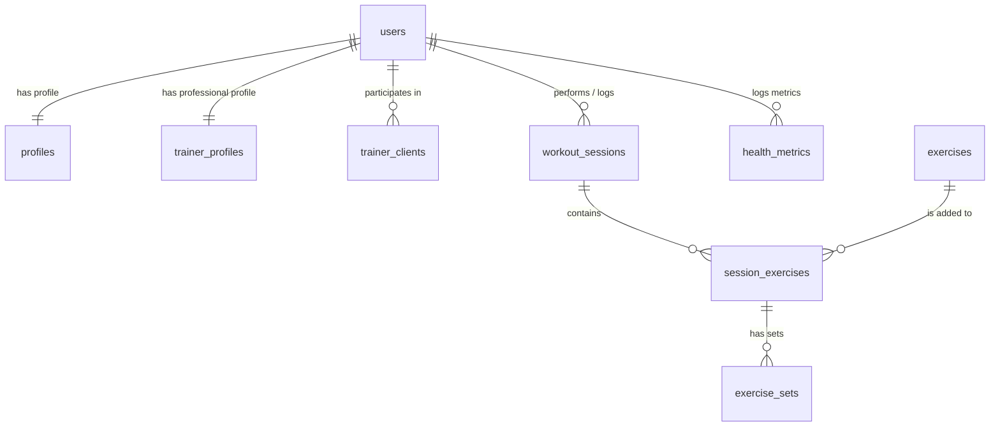

# Kyber Fitness — High-Performance Biometric Portal

Kyber Fitness is a premium, full-stack fitness and athletic coaching dashboard built for high-performance individual athletes and professional personal trainers. Designed with the high-voltage Stitch Kinetic aesthetic system, it provides a unified platform to log workouts, track health trends, and coordinate secure trainer-client collaborations.

---

## Architectural Core & Stack

Kyber Fitness utilizes an isomorphic, typesafe React 19 stack built on the edge:

*   **App Framework:** [TanStack Start](https://tanstack.com/start) (React 19 + Vinxi SSR) for high-performance isomorphic rendering and server functions.
*   **Routing System:** [TanStack Router](https://tanstack.com/router) for typesafe, file-system-based navigation and automatic code splitting.
*   **Identity & Authentication:** [Clerk](https://clerk.com) (`@clerk/tanstack-start`) for seamless user sessions and multi-tenant portal gates.
*   **Database & Persistence:** [Drizzle ORM](https://orm.drizzle.team) + local **SQLite** (`better-sqlite3`) resolving directly to the local database file `fitness.db`.
*   **Design & Layout:** [Tailwind CSS v4](https://tailwindcss.com) + custom **Vanilla CSS** tokens providing glassmorphic bento blocks, dynamic grid layouts, and custom micro-animations.
*   **Telemetry Visuals:** Glowing custom **SVG trendlines** and Lucide React icons for advanced biometric charting.

---

## Stitch Kinetic Aesthetic Guidelines

The application strictly implements the Kinetic design principles to create a visual-first SaaS dashboard:

*   **Contrast Base:** Deep, low-fatigue charcoal surfaces (`#0a0a0a` / `#131313`) generating premium modern depth.
*   **CTA Highlighters:** **Electric Lime** (`#c3f400`) primary markers for success nodes, action triggers, and primary biometric progress.
*   **Tech Accents:** **Cyan** (`#00eefc`) secondary lines for charting trends, diagnostic metrics, and structural borders.
*   **Glassmorphic Surfaces:** Backdrop-filtered translucent panels (`rgba(255, 255, 255, 0.03)` with `backdrop-filter: blur(12px)`) that let glowing background meshes bleed through.

---

## Relational Database Schema

The database uses a lightweight SQLite store mapped with Drizzle. The structural architecture resolves user records directly to Clerk identities via the unique `userId` key:



1.  **`users`:** Secure credentials container syncing Clerk auth ids with role specifications (`individual` or `trainer`).
2.  **`profiles`:** Bio metrics (Date of Birth, gender, height, activity coefficient, fitness goals).
3.  **`trainer_profiles`:** Pro coach directory listing studio business titles, specialty fields, bios, and experience durations.
4.  **`trainer_clients`:** Network mapping between trainers and athletes with status flags (`pending`, `active`, `declined`) and granular reading/writing permissions.
5.  **`workout_sessions`:** Workout containers cataloging date, title, duration, and notes.
6.  **`exercises` & `exercise_sets`:** Logged movements preloaded with 15 global standard routines (strength, cardio, bodyweight) plus custom client-created sets tracking reps, weights, distances, durations, and intensity (RPE).
7.  **`health_metrics`:** Historical timelines of athlete tracking (body weight, body fat %, heart rate indices).

---

## Key Architectural Resolutions & Optimization

During the development process, we implemented several critical configurations to resolve SSR and server function limitations under Vinxi and Clerk:

### 1. Clerk SSR Context Externalization Bypass
*   **Symptom:** Vinxi threw fatal `Error: Context is not available` on initial server renders during `getAuth` evaluations.
*   **Cause:** Clerk's `@clerk/tanstack-start` package was being loaded as an external module, running in a isolated scope that did not share H3's `AsyncLocalStorage` instance.
*   **Resolution:** Configured `ssr.noExternal: ['@clerk/tanstack-start']` inside `vite.config.ts` to force Vite to bundle Clerk inline, syncing the isomorphic request context perfectly.

### 2. Stream Lock & Disturbed Request Stream Bypass
*   **Symptom:** Submitting POST server functions (such as profile onboarding or workout logging) threw `TypeError: Response body object should not be disturbed or locked` and returned `401 Unauthorized` states.
*   **Cause:** TanStack Start consumes the incoming request body stream to validate form input. Passing this same stream to Clerk's `getAuth` middleware triggers stream conflicts since the body stream has already been read.
*   **Resolution:** Built a request-sanitizing utility `createAuthRequest` in `auth-server.ts` that clones the request headers but forces the HTTP method to `'GET'`. Because GET requests carry no body streams, Clerk retrieves auth signatures seamlessly without stream collisions.

### 3. Server-Side Access Validation Hook
*   **Symptom:** Protecting database transactions against unauthorized clients.
*   **Resolution:** Enforced `verifyTrainerClientAccess(trainerId, clientId)` inside server actions. A trainer can only query or log biometric details for an athlete if an active relationship (`trainerClients.status = 'active'`) exists with the correct permissions.

---

## Local Development Runbook

Follow these steps to run the application in your local development environment:

### 1. Prepare Environment Variables
Create a `.env` file in the repository root:
```env
VITE_CLERK_PUBLISHABLE_KEY=pk_test_...
CLERK_SECRET_KEY=sk_test_...
VITE_CLERK_SIGN_IN_URL=/sign-in
VITE_CLERK_SIGN_UP_URL=/sign-up
```
*Note: SQLite database points directly to `fitness.db` in the workspace root. No database URL configuration is needed.*

### 2. Install Dependencies & Build
```bash
# Install packages using pnpm
pnpm install

# Compile the routing tree and verify TS type-safety
pnpm run build
```

### 3. Database Initialization & Seeding
```bash
# Push schema migrations to the local SQLite database file
npx drizzle-kit push

# Populate database with standard exercise sets and mock trainers
pnpm run db:seed
```

### 4. Run the Dev Server
```bash
# Spin up the Vinxi server (runs on http://localhost:3000)
pnpm run dev
```

---

## Netlify Serverless Deployment & Hosting Setup

Kyber Fitness is fully configured for deployment on **Netlify** using TanStack Start's official Netlify adapter.

### 1. Adapter and Bundler Configuration
We installed `@netlify/vite-plugin-tanstack-start` and integrated it into the plugins array of `vite.config.ts`:
```typescript
import netlify from '@netlify/vite-plugin-tanstack-start'

export default defineConfig({
  plugins: [
    // ... other plugins
    netlify(),
  ],
})
```
This allows Netlify to seamlessly intercept the build process, generating the edge and serverless runtime files inside `.netlify/v1/functions/server.mjs`.

### 2. Build Settings (`netlify.toml`)
Build settings are declared inside `netlify.toml` in the project root:
```toml
[build]
  command = "pnpm run build"
  publish = "dist/client"

[dev]
  command = "pnpm run dev"
  port = 3000
```

### 3. pnpm Workspace Build Permissions
To support **pnpm v11+** workspace security controls, we configured `pnpm-workspace.yaml` to explicitly permit local script builds for key packages (like `better-sqlite3`, `lightningcss`, `esbuild`, and `sharp`):
```yaml
allowBuilds:
  "@clerk/shared": true
  "@parcel/watcher": true
  "better-sqlite3": true
  "esbuild": true
  "lightningcss": true
  "sharp": true
```

### 4. Netlify Dashboard Environment Variables
To complete the build and runtime pipeline, navigate to **Site configuration > Environment variables** in your Netlify Dashboard and define the following variables:
*   `VITE_CLERK_PUBLISHABLE_KEY`: Clerk's public key.
*   `CLERK_SECRET_KEY`: Clerk's private API key.
*   `VITE_CLERK_SIGN_IN_URL`: `/sign-in`
*   `VITE_CLERK_SIGN_UP_URL`: `/sign-up`

---
---

## Security & Permissive Operations Matrix

*   **Athletes:** Complete control over personal biometric inputs, weight history, and private logging. Athletes have explicit authority to revoke trainer access at any time from the `/my-trainers` console.
*   **Trainers:** Access is strictly read-only for metrics unless the client grants explicit write permissions (`canAddSessions = true`). All database writes are signed with `recordedByUserId` for full accountability.
