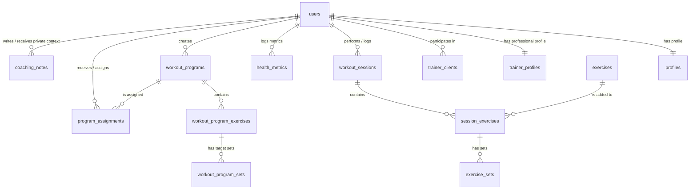

# Kyber Fitness — High-Performance Biometric Portal

Kyber Fitness is a premium, full-stack fitness and athletic coaching dashboard built for high-performance individual athletes and professional personal trainers. Designed with the high-voltage Stitch Kinetic aesthetic system, it provides a unified platform to log workouts, track health trends, build reusable coaching programs, assign routines to athletes, and coordinate secure trainer-client collaborations.

---

## Architectural Core & Stack

Kyber Fitness utilizes an isomorphic, typesafe React 19 stack built on the edge:

- **App Framework:** [TanStack Start](https://tanstack.com/start) (React 19 + Vinxi SSR) for high-performance isomorphic rendering and server functions.
- **Routing System:** [TanStack Router](https://tanstack.com/router) for typesafe, file-system-based navigation and automatic code splitting.
- **Identity & Authentication:** [Clerk](https://clerk.com) (`@clerk/tanstack-start`) for seamless user sessions and multi-tenant portal gates.
- **Database & Persistence:** [Drizzle ORM](https://orm.drizzle.team) + **Turso/libSQL** for durable production SQLite, with a local `fitness.db` fallback for development.
- **Design & Layout:** [Tailwind CSS v4](https://tailwindcss.com) + custom **Vanilla CSS** tokens providing glassmorphic bento blocks, dynamic grid layouts, light/dark theme modes, and custom micro-animations.
- **Telemetry Visuals:** Glowing custom **SVG trendlines** and Lucide React icons for advanced biometric charting.
- **Quality Tooling:** [Oxlint](https://oxc.rs/docs/guide/usage/linter) for fast JavaScript/TypeScript linting and [Prettier](https://prettier.io) for repo-wide formatting.

Shared TypeScript data-transfer and form/editor shapes live under `src/types`. Component-only prop/helper types live beside their component in `*.types.ts` files. This keeps route files focused on behavior and prevents duplicated workout, program, profile, and trainer-client shapes from drifting.

---

## Current Product Surface

- **Landing and auth:** A premium public landing page plus Clerk-powered `/sign-in` and `/sign-up` routes with splat support for path-based multi-step auth.
- **Onboarding and settings:** Role-aware onboarding for athletes and trainers, with unified profile and credential editing in `/settings`.
- **Athlete dashboard:** Workout totals, assigned-routine prompts, quick body-weight logging, and recent activity summaries.
- **Workout logging and review:** Custom workout session builder with global/custom exercises, set targets, reps, load, distance, duration, rest, intensity, notes, dedicated session detail pages, and permission-checked edit/delete flows.
- **Health metrics:** Timelines for weight, body fat, and resting heart rate, including trainer-supported client metric logging plus permission-checked metric correction and deletion when access allows.
- **Trainer clients:** Client invitation, active relationship management, athlete profile/metric views, and permission-guarded client logging.
- **Trainer coaching notes:** Trainer-private client notes with pinned follow-ups, update/delete controls, and active relationship enforcement.
- **Program builder:** Trainer-only program templates with ordered exercises and target sets.
- **Program assignment flow:** Trainers assign programs to active clients; athletes can open pending assignments, preload the routine into `/workouts/new`, record the actual session, and complete the assignment through a server-validated workflow.

---

## Stitch Kinetic Aesthetic Guidelines

The application strictly implements the Kinetic design principles to create a visual-first SaaS dashboard:

- **Contrast Base:** Deep, low-fatigue charcoal surfaces (`#0a0a0a` / `#131313`) generating premium modern depth.
- **Theme Modes:** Light, dark, and system-auto modes are available through the app shell theme toggle. The initial mode is applied before hydration to prevent visible theme flash.
- **CTA Highlighters:** **Electric Lime** (`#c3f400`) primary markers for success nodes, action triggers, and primary biometric progress.
- **Tech Accents:** **Cyan** (`#00eefc`) secondary lines for charting trends, diagnostic metrics, and structural borders.
- **Glassmorphic Surfaces:** Backdrop-filtered translucent panels (`rgba(255, 255, 255, 0.03)` with `backdrop-filter: blur(12px)`) that let glowing background meshes bleed through.

---

## Relational Database Schema

The database uses a SQLite-compatible Turso/libSQL store mapped with Drizzle. The structural architecture resolves user records directly to Clerk identities via the unique `userId` key:



1.  **`users`:** Secure credentials container syncing Clerk auth ids with role specifications (`individual` or `trainer`).
2.  **`profiles`:** Bio metrics (Date of Birth, gender, height, activity coefficient, fitness goals).
3.  **`trainer_profiles`:** Pro coach directory listing studio business titles, specialty fields, bios, and experience durations.
4.  **`trainer_clients`:** Network mapping between trainers and athletes with status flags (`pending`, `active`, `declined`) and granular reading/writing permissions.
5.  **`workout_sessions`:** Workout containers cataloging date, title, duration, and notes.
6.  **`exercises` & `exercise_sets`:** Logged movements preloaded with 15 global standard routines (strength, cardio, bodyweight) plus custom client-created sets tracking reps, weights, distances, durations, and intensity (RPE).
7.  **`health_metrics`:** Historical timelines of athlete tracking (body weight, body fat %, resting heart rate).
8.  **`workout_programs`, `workout_program_exercises`, `workout_program_sets`:** Trainer-owned reusable routine templates with ordered movements, target sets, and coaching instructions.
9.  **`program_assignments`:** Direct trainer-to-athlete routine assignments with `pending` and `completed` states.
10. **`coaching_notes`:** Trainer-private client notes with pinned status and update timestamps, guarded by active trainer-client relationships.

---

## Key Architectural Resolutions & Optimization

During the development process, we implemented several critical configurations to resolve SSR and server function limitations under Vinxi and Clerk:

### 1. Clerk SSR Context Externalization Bypass

- **Symptom:** Vinxi threw fatal `Error: Context is not available` on initial server renders during `getAuth` evaluations.
- **Cause:** Clerk's `@clerk/tanstack-start` package was being loaded as an external module, running in a isolated scope that did not share H3's `AsyncLocalStorage` instance.
- **Resolution:** Configured `ssr.noExternal: ['@clerk/tanstack-start']` inside `vite.config.ts` to force Vite to bundle Clerk inline, syncing the isomorphic request context perfectly.

### 2. Stream Lock & Disturbed Request Stream Bypass

- **Symptom:** Submitting POST server functions (such as profile onboarding or workout logging) threw `TypeError: Response body object should not be disturbed or locked` and returned `401 Unauthorized` states.
- **Cause:** TanStack Start consumes the incoming request body stream to validate form input. Passing this same stream to Clerk's `getAuth` middleware triggers stream conflicts since the body stream has already been read.
- **Resolution:** Built a request-sanitizing utility `createAuthRequest` in `auth-server.ts` that clones the request headers but forces the HTTP method to `'GET'`. Because GET requests carry no body streams, Clerk retrieves auth signatures seamlessly without stream collisions.

### 3. Server-Side Access Validation Hook

- **Symptom:** Protecting database transactions against unauthorized clients.
- **Resolution:** Enforced `verifyTrainerClientAccess(trainerId, clientId)` inside server actions. A trainer can only query or log biometric details for an athlete if an active relationship (`trainerClients.status = 'active'`) exists with the correct permissions.

### 4. Program Ownership and Assignment Validation

- **Symptom:** Workout program templates and assigned routines can expose sensitive coaching data if loaded only by a client-provided `programId`.
- **Resolution:** Program details are guarded server-side. Trainers can access only programs they created. Athletes can access assigned program details only through an assignment belonging to their user ID. Completing a program assignment requires a pending assignment for the current athlete; coach-entered client sessions cannot mark athlete assignments complete.

### 5. Client and Server Diagnostics Guards (ERR_TOO_MANY_REDIRECTS Bypass)

- **Symptom:** In live serverless environments like Netlify, if Clerk API keys are missing, unconfigured, or set to standard placeholders (`pk_test_placeholder`), the Clerk SSR middleware repeatedly redirects the browser to authenticate, producing a fatal browser `ERR_TOO_MANY_REDIRECTS` loop.
- **Cause:** Clerk's SSR wrapper forces authentication handshakes and throws redirection headers. Without valid keys, it gets stuck in an infinite redirect cascade.
- **Resolution:** Implemented robust diagnostic overrides in the application lifecycle:
  - **Server-Side Guard (`src/server.ts`):** Before initializing Vinxi's `createClerkHandler`, the server checks for the presence and validity of `CLERK_PUBLISHABLE_KEY` and `CLERK_SECRET_KEY`. If keys are invalid or missing, it bypasses Clerk completely and intercepts document requests to serve a gorgeous, dark-themed diagnostic page outlining the required environment variables.
  - **Client-Side Guard (`src/routes/__root.tsx`):** If the publishable key is missing or set to a placeholder, the `<ClerkProvider>` wrap is bypassed entirely on the client, rendering a unified "Sync Offline" diagnostic viewport to guide configuration.

---

## Local Development Runbook

Follow these steps to run the application in your local development environment:

### 1. Prepare Environment Variables

Create a `.env` file in the repository root:

```env
VITE_CLERK_PUBLISHABLE_KEY=pk_test_...
CLERK_SECRET_KEY=sk_test_...
VITE_CLERK_SIGN_IN_URL=/sign-in
VITE_CLERK_SIGN_UP_URL=/sign-up
VITE_CLERK_SIGN_IN_FORCE_REDIRECT_URL=/dashboard
VITE_CLERK_SIGN_UP_FORCE_REDIRECT_URL=/onboarding
VITE_CLERK_SIGN_IN_FALLBACK_REDIRECT_URL=/dashboard
VITE_CLERK_SIGN_UP_FALLBACK_REDIRECT_URL=/onboarding
TURSO_DATABASE_URL=libsql://your-db.turso.io
TURSO_AUTH_TOKEN=...
```

_Note: If Turso credentials are omitted locally, the app falls back to `fitness.db` in the workspace root. Production should always use `TURSO_DATABASE_URL` and `TURSO_AUTH_TOKEN`._

### 2. Install Dependencies & Build

```bash
# Install packages using pnpm
pnpm install

# Compile the routing tree and verify TS type-safety
pnpm run build
```

### 3. Database Initialization & Seeding

```bash
# Push schema changes to Turso when TURSO_DATABASE_URL is set,
# or to the local SQLite fallback when it is not.
pnpm run db:push

# Populate database with standard exercise sets and mock trainers
pnpm run db:seed
```

### 4. Run the Dev Server

```bash
# Spin up the Vinxi server (runs on http://localhost:3000)
pnpm run dev
```

### 5. Quality Commands

```bash
# Run fast JavaScript/TypeScript linting
pnpm run lint

# Apply safe lint fixes
pnpm run lint:fix

# Format all tracked source/docs/config files
pnpm run format

# Verify formatting for CI or review
pnpm run format:check
```

Prettier ignores generated/build artifacts such as `dist`, `.netlify`, `.tanstack`, `fitness.db`, `pnpm-lock.yaml`, and `src/routeTree.gen.ts`. Oxlint ignores the same generated/build surfaces through `.oxlintrc.json`.

---

## Netlify Serverless Deployment & Hosting Setup

Kyber Fitness is fully configured for deployment on **Netlify** using TanStack Start's official Netlify adapter.

### 1. Adapter and Bundler Configuration

We installed `@netlify/vite-plugin-tanstack-start` and integrated it into the plugins array of `vite.config.ts`:

```typescript
import netlify from '@netlify/vite-plugin-tanstack-start'

export default defineConfig({
  plugins: [
    // ... other plugins
    netlify(),
  ],
})
```

This allows Netlify to seamlessly intercept the build process, generating the edge and serverless runtime files inside `.netlify/v1/functions/server.mjs`.

### 2. Build Settings (`netlify.toml`)

Build settings are declared inside `netlify.toml` in the project root:

```toml
[build]
  command = "pnpm run build"
  publish = "dist/client"

[dev]
  command = "pnpm run dev"
  port = 3000
```

### 3. pnpm Workspace Build Permissions

To support **pnpm v11+** workspace security controls, we configured `pnpm-workspace.yaml` to explicitly permit local script builds for key packages (like `lightningcss`, `esbuild`, and `sharp`):

```yaml
allowBuilds:
  '@clerk/shared': true
  '@parcel/watcher': true
  'esbuild': true
  'lightningcss': true
  'sharp': true
```

### 4. Netlify Dashboard Environment Variables

To complete the build and runtime pipeline, navigate to **Site configuration > Environment variables** in your Netlify Dashboard and define the following variables:

- `VITE_CLERK_PUBLISHABLE_KEY`: Clerk's public key.
- `CLERK_SECRET_KEY`: Clerk's private API key.
- `VITE_CLERK_SIGN_IN_URL`: `/sign-in`
- `VITE_CLERK_SIGN_UP_URL`: `/sign-up`
- `VITE_CLERK_SIGN_IN_FORCE_REDIRECT_URL`: final post-login target, usually `/dashboard`.
- `VITE_CLERK_SIGN_UP_FORCE_REDIRECT_URL`: final post-registration target, usually `/onboarding`.
- `VITE_CLERK_SIGN_IN_FALLBACK_REDIRECT_URL`: `/dashboard`
- `VITE_CLERK_SIGN_UP_FALLBACK_REDIRECT_URL`: `/onboarding`
- `TURSO_DATABASE_URL`: Turso/libSQL database URL, for example `libsql://...`.
- `TURSO_AUTH_TOKEN`: Turso database auth token.

The app sends Clerk's immediate force redirect back through the client-side auth page with a small app-owned target parameter. A shared redirect utility strips auth query parameters from the URL and then performs a second clean redirect to the configured final target.

### 5. Strict Dependency Resolution (`unctx`)

To resolve Rolldown/Vite compilation errors under pnpm's strict dependency model, `unctx` was added as a direct dependency in `package.json`. This guarantees that our Nitro context-retrieval shims inside `src/shim.ts` resolve perfectly during production bundler compilation on Netlify.

---

---

## Security & Permissive Operations Matrix

- **Profile Settings:** Both athletes and trainers have access to the `/settings` interface to dynamically manage their registration variables, biometrics ledger (height, goal, activity level), or coaching credentials (specialization, studio business title, experience).
- **Athletes:** Complete control over personal biometric inputs, weight history, and private logging. Athletes have explicit authority to revoke trainer access at any time from the `/my-trainers` console.
- **Trainers:** Access is strictly read-only for metrics unless the client grants explicit write permissions (`canAddSessions = true`). All database writes are signed with `recordedByUserId` for full accountability.
- **Program Templates:** Trainers can edit/delete only templates they created. Athletes can view assigned program content only through their own assignment records.
- **Assignment Completion:** Workout assignment completion is validated server-side against the current athlete, the assignment ID, and `status = 'pending'`.

---

## Documentation Maintenance Rule

When adding or changing product features, routes, server actions, database schema, permissions, environment variables, deployment behavior, or developer tooling, update both `README.md` and `AGENTS.md` in the same branch. New features are not considered complete until the user-facing overview and the agent implementation guide both reflect the change.
